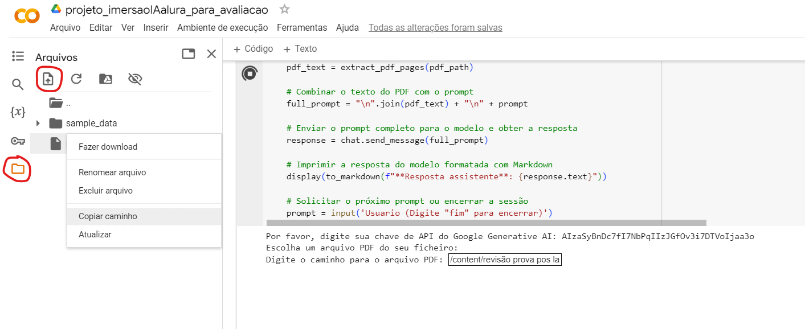

# Resumo
Este projeto é resultado da participação na imersão em Inteligência Artificial do Alura, em parceria com o Google. Desenvolvemos uma ferramenta que permite aos usuários explorar o conteúdo de arquivos PDF através de uma conversa interativa com a inteligência artificial Gemini. Combinando aprendizado prático e tecnologia de ponta, oferecemos uma experiência educativa e inovadora na análise de documentos digitais.

# Conversor de PDF para Conversa com Gemini

Esse MVP desenvolvido  com o googleColab na linguagem Python, permite que você converta o conteúdo de um arquivo PDF em uma conversa interativa com Gemini, a inteligência artificial do Google. Com ele, você pode explorar o conteúdo do arquivo PDF selecionado através de uma interface simples e manter uma conversa educativa e informativa.

# QUAL PROBLEMA O PROGRAMA SE PROPÕE A RESOLVER?
"O objetivo da 'Conversor de PDF para Conversa com Gemini' é resolver problemas relacionados à falta de informações precisas para a inteligência artificial Gemini. Ao explorar os arquivos selecionados pelos usuários, esta ferramenta proporciona uma maneira simples de inserir dados para análise pela Gemini, mitigando preocupações como a falta de informações relevantes para aprimorar o desempenho da IA."

# Uso
1. Execute o script em seu ambiente Python preferido, de preferência no Google Colab.
2. Ao inciar script insira sua chave de API no campo solicitado para estabelecer a conexão com o Google Gemini e desfrutar de todas as funcionalidades oferecidas pelo programa
3. Siga as instruções na interface para fornecer o caminho do arquivo PDF que deseja explorar.
4. Após selecionar o arquivo, você pode iniciar a conversa com Gemini.
5. Você receberá respostas contextualizadas com base no conteúdo do arquivo PDF e nas perguntas que você fizer.

### inserir arquivo pdf no programa

1. Ícone de pasta: Clique no ícone da pasta no menu lateral esquerdo para abrir o explorador de arquivos.
2. Ícone de upload: Clique no ícone de upload (seta para cima) na parte superior do explorador de arquivos.
3. Selecionar arquivo: Escolha o arquivo desejado do seu computador e clique em "Abrir". O arquivo será carregado para o armazenamento da sessão.
4. Clique com o botão direito: No explorador de arquivos, clique com o botão direito do mouse sobre o nome do arquivo que você acabou de enviar.
5. Copiar caminho: No menu de contexto que aparece, selecione a opção "Copiar caminho". O caminho completo do arquivo será copiado para a área de transferência.
6. Cole o caminho do ficheiro na aplicação quando solicitado

### EXTRA
Também foi adicionado o arquivo .py para que possa da mesma forma ser rodado na maquina local do Usuário

